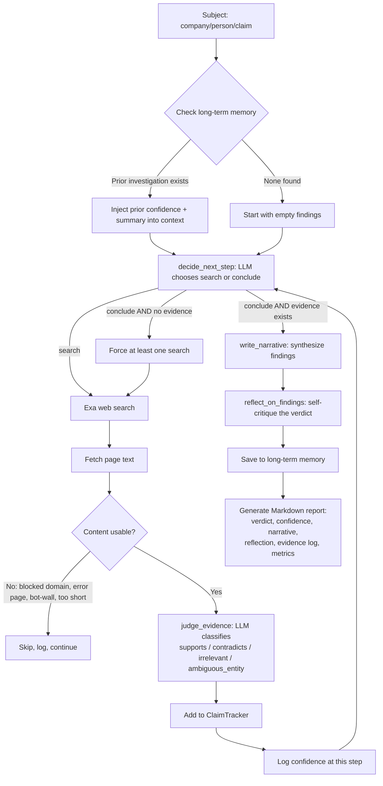

# OSINT Investigation Harness

An autonomous agent that investigates a company, person, or factual claim: it searches the web, reads pages, judges evidence, tracks source reliability, remembers past investigations, critiques its own conclusions, and produces a structured Markdown report — built for the CerebralZip Data Science Internship take-home.

## Setup

```bash
git clone <https://github.com/Mansha-Khod/cerebralzip-osint-agent>
cd cerebralzip-osint-agent
python -m venv venv
venv\Scripts\activate          # Windows
source venv/bin/activate       # Mac/Linux
pip install -r requirements.txt
```

Copy `.env.example` to `.env` and fill in:
```
EXA_API_KEY=your_key_here
GROQ_API_KEY=your_key_here
```
- **Exa** (search) — free tier at [exa.ai](https://exa.ai), pay-as-you-go with monthly free credits.
- **Groq** (LLM inference) — free tier at [console.groq.com](https://console.groq.com), no card required. Model used: `openai/gpt-oss-120b`.

## Running it

**Single investigation (CLI):**
```bash
python main.py --subject "Company Name" --type company
```
`--type` accepts `company`, `person`, or `claim`. Add `--no-memory` to disable long-term memory recall/save for that run.

**Benchmark across multiple cases:**
```bash
python benchmark.py
```
Runs all subjects in `BENCHMARK_SUBJECTS` (in `benchmark.py`) and writes a report per subject to `reports/`.

**Minimal web frontend:**
```bash
uvicorn src.api:app --reload
```
Open `http://127.0.0.1:8000`. One form, one endpoint — kept deliberately unstyled per the assignment brief's instruction to prioritize backend/AI logic over frontend polish.

## Architecture



**Modules:**
- `src/search_tool.py` — Exa web search wrapper
- `src/page_fetcher.py` — page text extraction, with SSL fallback and browser headers
- `src/claim_tracker.py` — evidence storage, tiered source reliability, verdict/confidence calculation
- `src/memory.py` — SQLite-backed long-term memory (cross-investigation recall)
- `src/metrics.py` — step/episode reward formulas
- `src/agent.py` — the decide → search → fetch → judge loop, narrative + reflection generation
- `src/report.py` — Markdown report assembly
- `src/logger.py` — JSONL step-by-step logging
- `main.py` / `benchmark.py` / `src/api.py` — CLI, multi-case runner, and minimal web frontend

## Key design choices (see REPORT.md for full rationale)

- **Exa over Tavily/SerpAPI/Brave** — generous free-credit model, low setup friction for a 48-hour build.
- **Groq (`openai/gpt-oss-120b`) over paid Anthropic/OpenAI** — genuinely free tier, sufficient reasoning quality for classification + planning tasks. Model name is a single constant (`MODEL_NAME` in `agent.py`) after two Groq models were deprecated mid-project.
- **Verdict and confidence are separate fields.** Confidence measures how strongly evidence leans in one direction — a well-supported *disproven* claim scores high confidence, not zero. `verdict` (`supported` / `contradicted` / `inconclusive` / `insufficient_evidence`) carries the direction.
- **Tiered source reliability** (official/government > established media > business-data aggregators > everything else, including a subject's own website) rather than a binary trusted/untrusted list.
- **A hand-rolled decide→act→observe loop**, not an agent framework — chosen for transparency and because the brief rewards demonstrated understanding over framework usage.
- **The agent cannot conclude with zero evidence gathered** — a hard guard against the LLM answering from its own training knowledge instead of what was actually investigated this run.

## Known limitations

See `REPORT.md` → Limitations for the full list. Headline ones: JS-rendered pages (Cloudflare/bot-walled sites) can't be scraped without a headless browser; entity disambiguation for generically-named subjects is heuristic, not guaranteed; content-emptiness filtering catches known failure signatures rather than solving "is this text actually informative" in general.